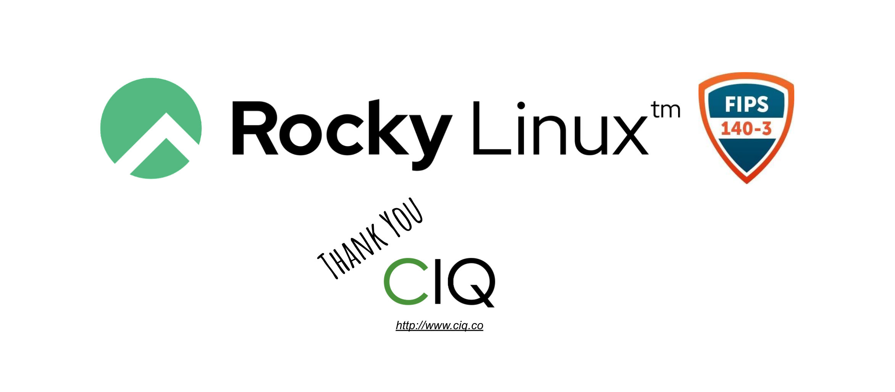

We are excited to announce that Rocky Linux has reached a significant step in the FIPS 140-3 validation process; right on schedule, Rocky Linux is now named in the [NIST Implementation Under Test List](https://csrc.nist.gov/Projects/Cryptographic-Module-Validation-Program/Modules-In-Process/IUT-List).

A big, gigantic thank you to our founding partner and sponsor [@CtrlIQ](https://ciq.co/rocky-linux) (CIQ), who has arranged and paid for the FIPS validation process and will be providing it back to the entire RESF / Rocky community for free!

This is not a small effort, the FIPS validation is a near million dollar investment, and even more including the engineering effort. We are all very grateful for this amazing contribution to the open source community!

## What is FIPS?

The Federal Information Processing Standard Publication 140-3, [FIPS 140-3](https://nvlpubs.nist.gov/nistpubs/FIPS/NIST.FIPS.140-3.pdf) is a U.S. government computer security standard used to approve cryptographic modules. FIPS validation is required in many applications with high security requirements, such as in health care, government, defense, and financial environments.
