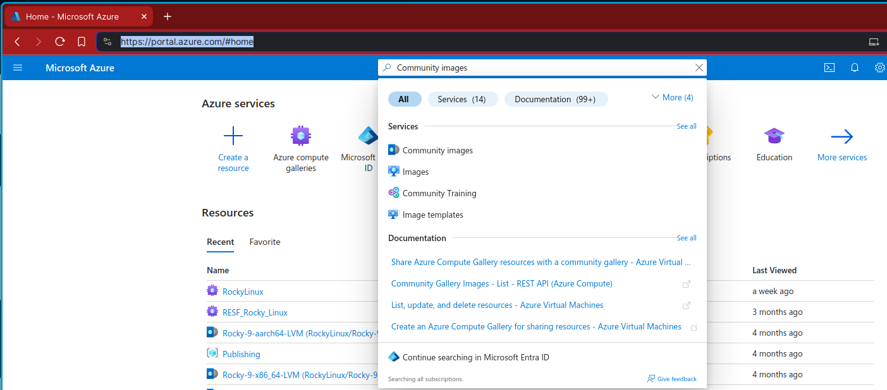
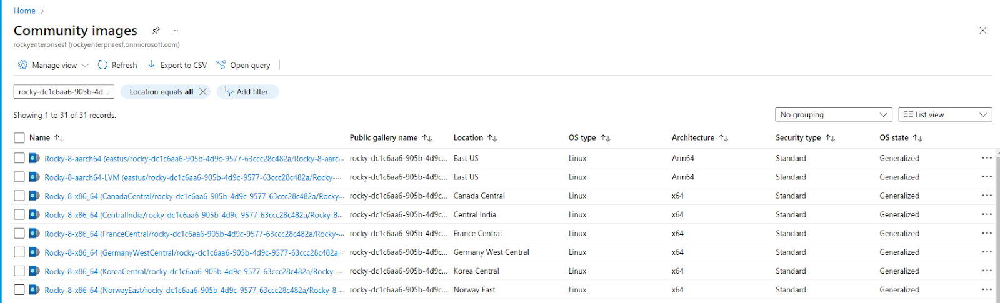
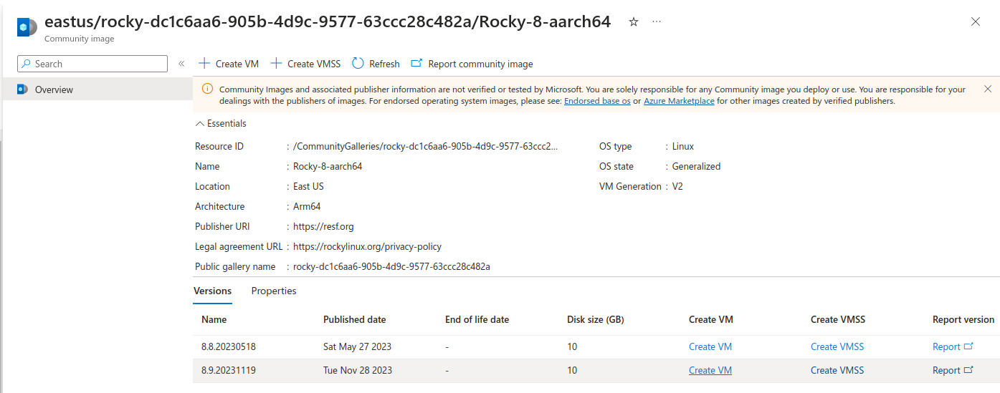
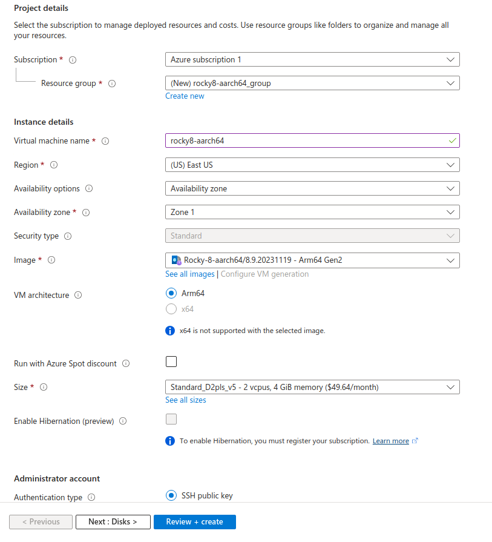
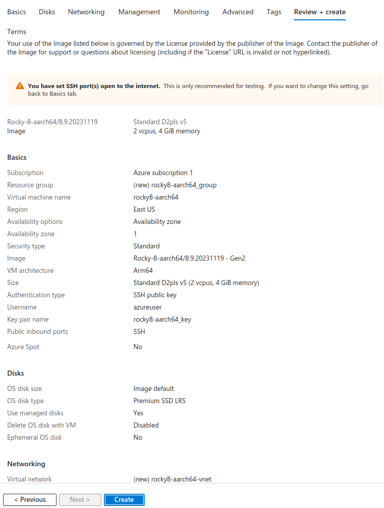

# Rocky Linux included in new Azure Community Galleries Feature

Downloading Rocky Linux from Azure community galleries has been more accessible since November 2023, with prebuilt images for x86_64 and aarch64 accompanying the version 8.9 and 9.3 release.

## Changes in accessibility

Historically images of open-source operating systems have not been included in Azure unless they are packaged for-profit with specific paid offerings and long term support. With the advent of standalone enterprise-class community Linux has come the case for expanding inclusion.

Understanding this, Microsoft was willing to work with the Rocky Linux team and others to secure this change. We appreciate the patience and persistence of everyone involved—from gathering information and solving technological puzzles to allocating resources. As a result of this new form of availability, more developers and universities and other use-cases can utilize community-driven enterprise software for everything from SBCs to HPC via [Community Gallery](https://aka.ms/communitygallery).

Learn more about community galleries in Azure from the [Microsoft blog](https://aka.ms/communitygalleryblog).

## Deploying Rocky Linux on Azure

Getting started with Rocky on Azure has never been easier–in just a few steps you can be up and running with a virtual machine anywhere in the world.

1.  Login to the Azure portal

    Login to Azure at [https://portal.azure.com/](https://portal.azure.com/)

2.  Search for Rocky Linux

    Search for “Community Images” in the top bar and navigate to the Service

    

    Once here, search for the Rocky Linux images using the gallery name “rocky-dc1c6aa6-905b-4d9c-9577-63ccc28c482a”.

    

3.  Select the image suiting your needs

    Rocky offers both Base and LVM-enabled images for both 8 and 9, depending on your preference. In both cases, the root partition is the last partition allowing for ease of expansion using growpart and/or LVM utilities.

    

4.  Configure the the Virtual Machine deployment

    Click the “Create VM” link on the image you wish to use to begin the deployment process. The portal will prompt you for information like the name, resource group, authentication details, and more.

    

5.  Review and start deployment

    Once satisfied with the configuration options, proceed to the Review + Create button to double check your settings and begin the deployment by clicking “Create”

    

Of course, you can also deploy these images using the command line, API, or your favorite Infrastructure-as-Code tool. Keep an eye out for a future blog post detailing how to get started with automated cloud deployments.

## Going forward

Our method of generating these images is related to the process of the Fedora Cloud SIG. At the moment we intend to refresh images on a regular schedule around the existing Rocky Linux release, and ideally keep all image versions available for use.

We are grateful for the efforts of the Fedora Cloud SIG and the Rocky Linux Cloud SIG in pushing this change forward, and Microsoft’s commitment to getting the community gallery option up and running.

Want to learn more about how community galleries work, and try it out yourself? Check out best practices [here](https://learn.microsoft.com/en-us/azure/virtual-machines/share-gallery-community).
