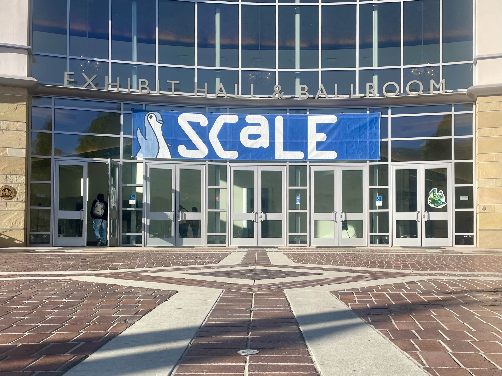

The Rocky Community team had a great time at the Southern California Linux Expo, aka SCaLE 21x, in Pasadena, California. We intentionally support regional Linux events like this, because local engagement is a big key to our success as an open-source community. 

## Social

Thursday we hosted a Birds of a Feather game night called “[Speed Migration with Rocky Linux](https://www.socallinuxexpo.org/scale/21x/presentations/rocky-linux-speed-migration-event)” in which players “migrated” games at random intervals, often in the middle of a hand. This worked decently well for Jenga and Uno, but proved more challenging with Yahtzee and Battleship. Either way, Rocky Linux is an excellent option when considering migrating to a new OS that is stable.

## Sessions

Friday was a great day for sessions. At the end of the day Krista Burdine, one of our community leaders, spoke as part of the UpScale social hour, about [growing open source community](https://www.youtube.com/live/JJk_-pkrQBQ?feature=shared&t=2426) by making your project accessible to newcomers. If you missed it, make sure you tune into the first 30 minutes of the linked video for a clever and Linux-y musical performance by Forrest Brazeal, entitled, “Songs to Enjoy while your servers deploy.” You won’t regret it.

## Working the Booth

Saturday we had the distinct pleasure of meeting a class of middle school students from Los Nietos STEAM Academy, who had just finished a Rocky Linux mini install day as part of their class on cybersecurity. They stopped by our booth for a photo opportunity, and warmed all our hearts with their enthusiasm. 

Saturday we also awarded raffle prizes. The OpenSUSE Mascot won the Rocky Linux lunch cooler. We also chose two additional winners for a hoodie and a long sleeve tee.

## Kids and a Really Cool Non-Profit

Sunday ended up being a lot about kids and kids-at-heart. This was the day for staff and other attendees to bring their families. We met lots of young kids, and figured out to plan our giveaways for that phenomenon next time.

And the kids-at-heart stole the show all weekend long. In one corner of the exhibit hall, the National Upcycled Computing Collective (NUCC Inc.) had a massive soda machine on display, appropriately named the Shell On Demand Appliance (SODA). For a donation, you could choose a “flavor” of Linux (we were partial to Rocky Brew) which yielded a ticket with a unique IP and password to allow you to ssh into the virtual machine and hack away. All proceeds supported [NUCC Inc](https://www.nuccinc.org/donate/)., a non-profit group facilitating computer education and research by upcycling computer parts in a meaningful way. After a good-natured rivalry all weekend between Rocky Brew and NixOS Pop, the real winner was NUCC, the nonprofit receiving donations. Follow the continuing adventures of the [SODA machine](https://twitter.com/ShellOnDemand) on X.

## Summary

From celebrating some of our project partners, OpenLogic by Perforce and AWS, to celebrating upcoming events we support (hello, GNOME and the GUADEC committee!); from saying hello to our upstream neighbors from Fedora and CentOS to greeting so many new friends, it was a busy and full event. Can't wait to return next time.

