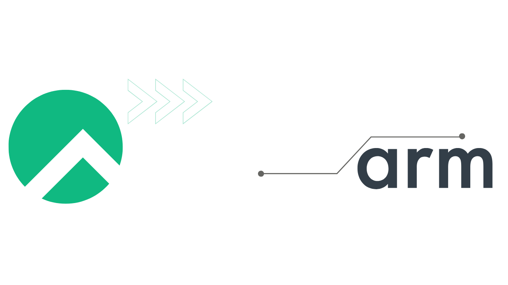

Over the next few days, updates will be released for Rocky Linux 8 and 9 updating a number of “critical path” components due to the expiration of the x509 certificate used to sign the build artifacts for the x86_64 (Intel/AMD) architecture. While this is a normal part of our processes, there are a few important things to know about this particular update.

## Immediate Actions and Key Dates

**To ensure the security and proper functioning of your systems:**

- **Beginning April 5th, 2024:** Update your systems with the released patches for Rocky Linux 8 and 9 as soon as they become available.
- **Expect:** Possibility for messages/logs regarding the certificate's expiration until the update is applied—these can be safely ignored.

**Key Updates Include:**

- **For Rocky Linux 8:** `fwupd-1.7.8-2.el8.rocky.0.3`, `grub2-2.02-150.el8.rocky.0.3`, `kernel-4.18.0-513.24.1`, and `shim-15.8-2`.
- **For Rocky Linux 9:** `fwupd-1.8.16-1.el9.rocky.0.3`, `grub2-2.06-70.el9_3.2.rocky.0.5`, `kernel-5.14.0-362.24.1.el9_3.0.1`, and `shim-15.8-2`.

## What’s Happening?

On April 11th, 2024, the certificates used to sign the x86_64 artifacts for Rocky Linux 8 and 9 will expire. The Release Engineering and Security Teams for Rocky Linux have taken this opportunity to unify the expiration for all certificates for Secure Boot, some of which have other disparate expiration dates due to being introduced mid-cycle--the UKI kernel is an example of such a certificate which was introduced for 8.9 and 9.3.

Due to this, several packages will be receiving updates and rebuilds without an associated upstream change. At the same time, we will be releasing version 15.8 of the `shim` package for Rocky Linux, which addresses several security vulnerabilities discovered upstream and includes these refreshed certificates.

## What’s The Impact?

Although the certificates are expiring, **there will be no direct impact to your systems**. Some messages may be seen in rare circumstances about the certificate expiration being in the past, but these can be disregarded until the systems are updated to packages with non-expired certificates.

Due to nuances in how Secure Boot chain validation is implemented, the expiration of certificates is not taken into account when determining whether or not to trust a particular artifact--as there is no reliable clock available at the time of validation.

## Updated Packages

The packages which will receive updates include: **grub2**, **fwupd**, **shim-x64**, **shim-a64**, and **kernels** from Rocky and the two Special Interest Groups which produce kernels: SIG/Kernel and SIG/Cloud.

For Rocky Linux 8, updated RPMs are:

- fwupd-1.7.8-2.el8.rocky.0.3
- grub2-2.02-150.el8.rocky.0.3
- kernel-4.18.0-513.24.1.el8_9
- shim-15.8-2.el8

For Rocky 9, the RPMs are:

- fwupd-1.8.16-1.el9.rocky.0.3
- grub2-2.06-70.el9_3.2.rocky.0.5
- kernel-5.14.0-362.24.1.el9_3.0.1
- shim-15.8-2.el9

## Secure Boot for ARM

You may have noticed a shim-a64 artifact with version 15.8, and that’s because Rocky Linux now supports Secure Boot on aarch64 (Armv8)! The team decided that when updating for version 15.8, we would utilize a hardware allocation and begin signing the ARM components for Secure Boot including fwupd, grub, kernel, and of course, the shim.

Our testing on various cloud providers has been successful in booting with Secure Boot validation, but if you know anyone with an ARM system that wants to test it out too, we’d love that--Please get in touch via Mattermost at https://chat.rockylinux.org/

## Summary

The Rocky Linux team is releasing a significant update due to the expiration of the x509 certificate used for signing x86_64 architecture build artifacts, impacting Rocky Linux 8 and 9.
There is no impact anticipated due to this process, though users might encounter messages or logs about the certificate's expiration date, which are non-issue until updates are applied.

If you have any questions, encounter any trouble, or wish to provide feedback, please get in touch via any of our communication methods. If you have a unique use case or deployment of Rocky, or just want to share an update story (good or bad!), **we want to hear from you**!

By the way, if you’re looking for an introduction to Secure Boot, check out [this presentation](https://youtu.be/lP4hSI8Fg3A) that Sherif Nagy, one of the Release Engineer team members, gave at Flock last summer.
