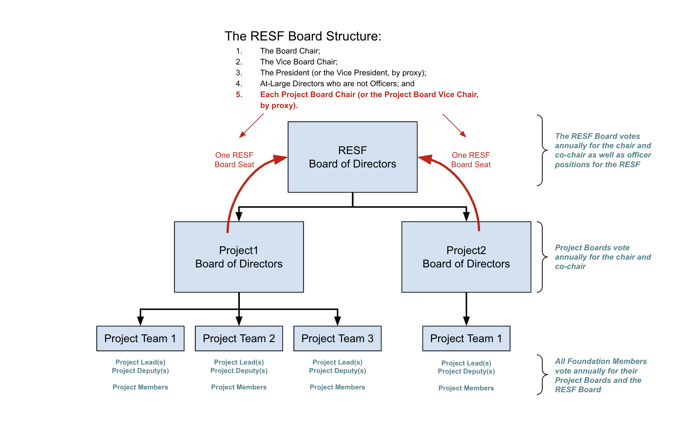

There is a structure of boards, with a summary as depicted in this image:

This structure was not invented by these bylaws and charter, but rather it is basically the merit-based structure that the RESF uses today. What we did do is formalize this structure, nomenclature, and process.

All board seats are voted by peers based only on merit. No board seats are ever purchased or bought, and no single company can represent more than 1/3rd of any voting board.
